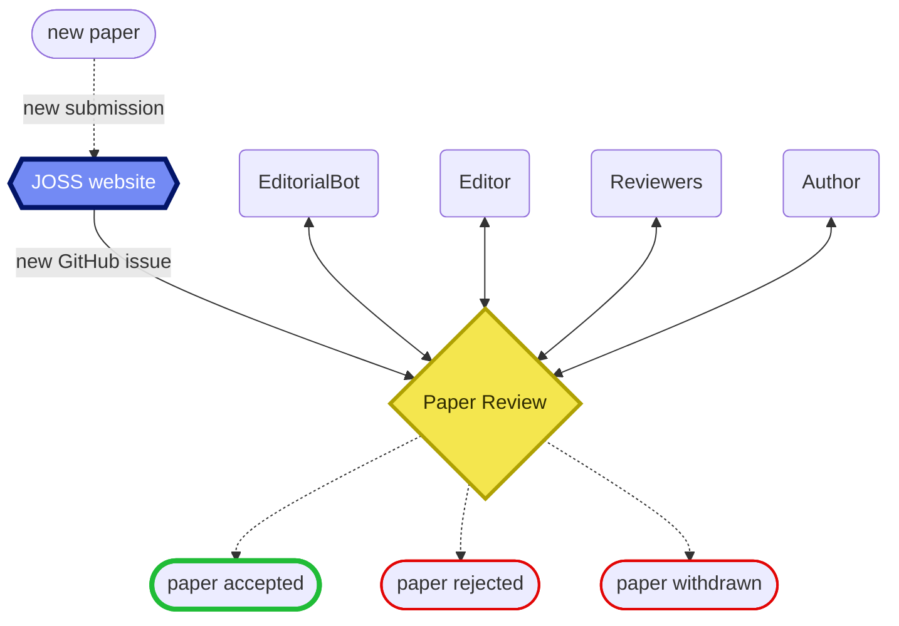

# JOSS Infrastructure Documentation

Find here information and help on how the Journal of Open Source Software infrastructure works

## Get started

- Flow of a paper submission
- Troubleshooting common errors

## Components

- [JOSS](./docs/joss.md)
- [Editorialbot](./docs/buffy.md)
- [Inara](./docs/inara.md)
- [Reviewers application](./docs/reviewers.md)
- [GitHub Actions](./docs/github-actions.md)
- [GitHub Workflows](./docs/workflows.md)
- [Ancillary Ruby gems](./docs/gems.md)

