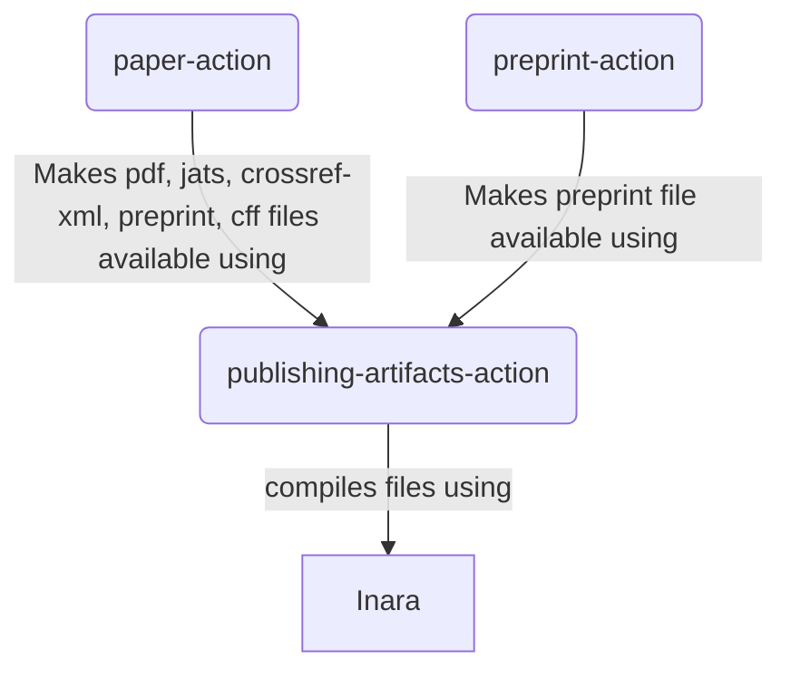
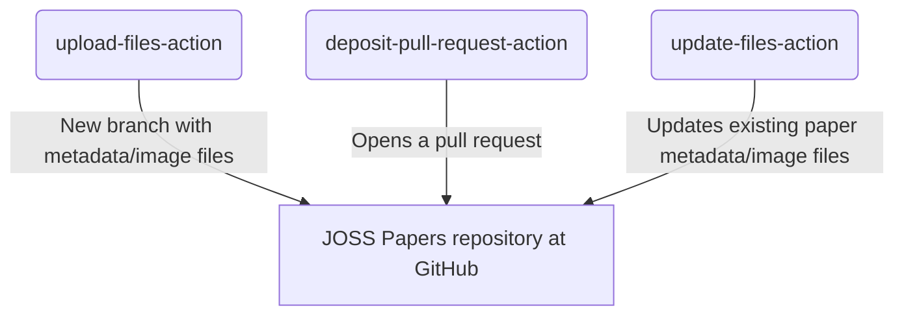
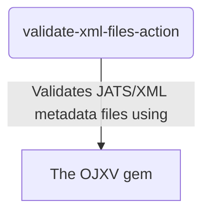
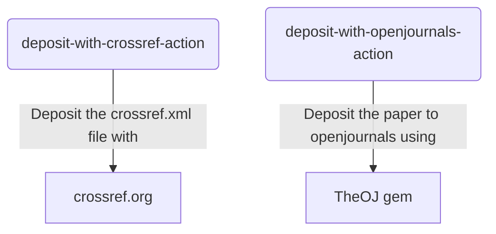
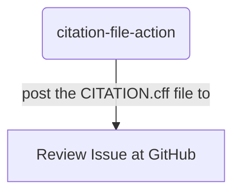
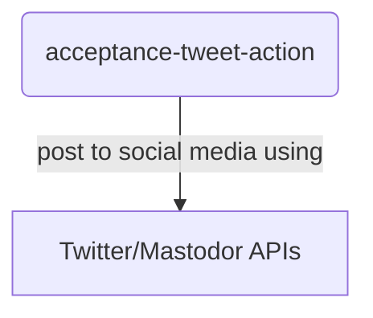

# GitHub Actions

```mermaid
flowchart TD
  PAPER(paper-action)
  PREPRINT(preprint-action)
  ARTIFACTS(publishing-artifacts-action)
    
  Inara[Inara]    

  ARTIFACTS --> |compiles files using| Inara
  PAPER --> |Makes pdf, jats, crossref-xml, preprint, cff files available using| ARTIFACTS
  PREPRINT --> |Makes preprint file available using| ARTIFACTS
```

```mermaid
flowchart TD
  UPLOAD(upload-files-action)
  PR(deposit-pull-request-action)
  UPDATE(update-files-action)
   
  PapersRepo[JOSS Papers repository at GitHub]

  UPLOAD --> |New branch with metadata/image files| PapersRepo
  PR --> |Opens a pull request| PapersRepo
  UPDATE --> |Updates existing paper metadata/image files| PapersRepo
```

```mermaid
flowchart TD
  VALIDATE(validate-xml-files-action)
   
  xml-validator[The OJXV gem]

  VALIDATE --> |Validates JATS/XML metadata files using| xml-validator
```

```mermaid
flowchart TD
  DEPOSIT-CROSSREF(deposit-with-crossref-action)
  DEPOSIT-OJ(deposit-with-openjournals-action)
  
  Openjournals[TheOJ gem]
  Crossref[crossref.org]
    
  DEPOSIT-OJ --> |Deposit the paper to openjournals using| Openjournals
  DEPOSIT-CROSSREF --> |Deposit the crossref.xml file with| Crossref
```

```mermaid
flowchart TD
  CITATION-INFO(citation-file-action)
   
  Review[Review Issue at GitHub]
   
  CITATION-INFO --> |post the CITATION.cff file to| Review
```

```mermaid
flowchart TD
  ACCEPTANCE-TWEET(acceptance-tweet-action)
  
  SocialMedia[Twitter/Mastodor APIs]
  
  ACCEPTANCE-TWEET --> |post to social media using| SocialMedia
```

    
