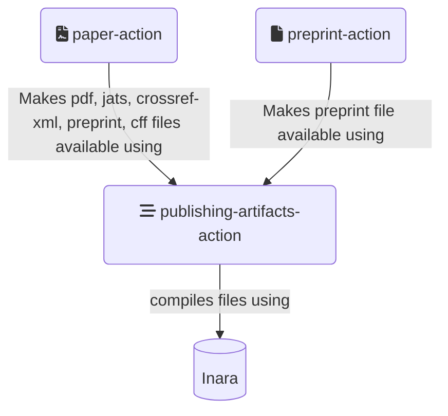
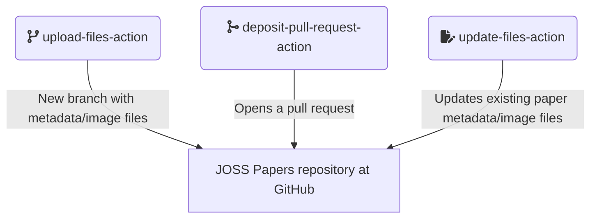
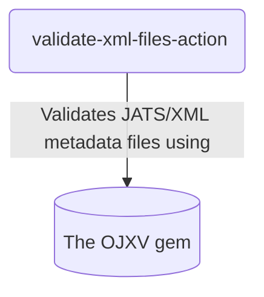
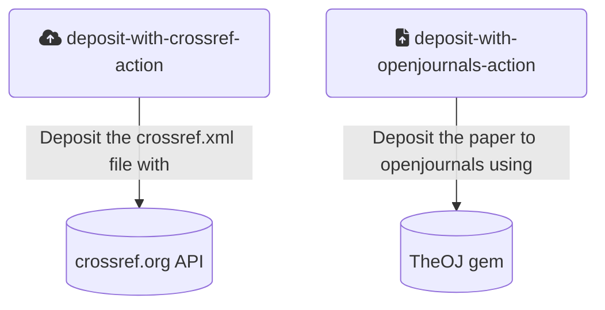
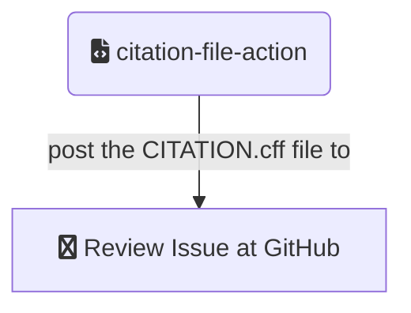
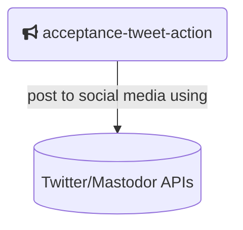

# GitHub Actions

There is a collection of small GitHub actions available to be used as steps in the different workflows run by JOSS at GitHub.

The actions are:

* **publishing-artifacts-action** 
* **paper-action**
* **preprint-action**  
* **upload-files-action** 
* **deposit-pull-request-action** 
* **update-files-action** 
* **validate-xml-files-action** 
* **deposit-with-crossref-action** 
* **deposit-with-openjournals-action** 
* **citation-file-action** 
* **acceptance-tweet-action** 

    
