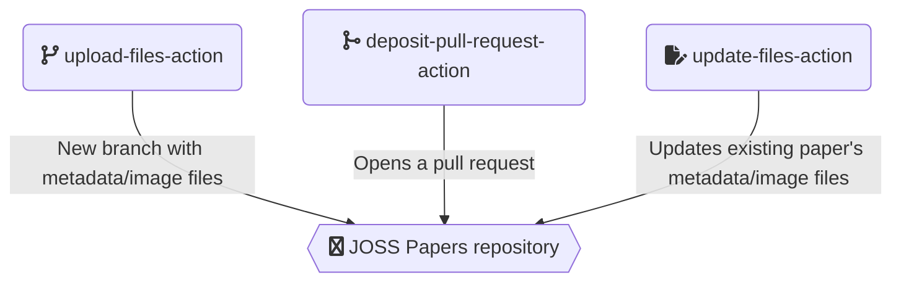
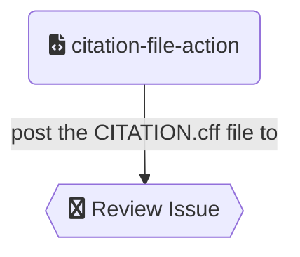

# GitHub Actions

This is a collection of small GitHub actions available to be combined and used as steps in the different [workflows](./workflows.md) run by JOSS at GitHub.

### **[Publishing artifacts](https://github.com/xuanxu/publishing-artifacts-action)**

  This action compiles a given paper.md markdown file and can generate PDF, JATS, Crossref XML, preprint and cff files.
  Under the hood it uses the [openjournals/inara action](https://github.com/openjournals/inara) to generate the output files.
  
### **[Paper](https://github.com/xuanxu/paper-action)**

  This action looks for a `paper.md` file in the specified repository and uses it to compile a Open Journals paper, generating PDF, Crossref XML, JATS and CFF outputs using the publishing artifacts action.

### **[Preprint](https://github.com/xuanxu/preprint-action)**

  This action looks for a paper.md file in the specified repository and uses it to generate (using the publishing artifacts action) a simple LaTeX file suitable to send to preprint archives.

### **[Upload files](https://github.com/xuanxu/upload-files-action)**

  This action creates a topic branch for a paper in the corresponding Open Journal's papers repository and adds the paper files (pdf/jats/crossref xml) to it.

### **[Pull request](https://github.com/xuanxu/deposit-pull-request-action)**

  This action opens a pull request for an accepted paper and optionally merges it

### **[Update files](https://github.com/xuanxu/update-files-action)**

  This action creates a topic branch in the corresponding Open Journal's papers repository and updates the published paper files (pdf/jats/crossref xml).

### **[Validate metadata files](https://github.com/xuanxu/validate-xml-files-action)**

  This action validates Open Journals' JATS and Crossref XML files. If an error happens it sends back a message to the review issue.

### **[Deposit with Open Journals](https://github.com/xuanxu/deposit-with-openjournals-action)**

  This action deposits an accepted paper with Open Journals

### **[Deposit with Crossref](https://github.com/xuanxu/deposit-with-crossref-action)**

  This action deposits an accepted paper with [Crossref](https://www.crossref.org/)

### **[Citation file](https://github.com/xuanxu/citation-file-action)**

  This action comments in the review issue with the contents of a CITATION.cff file.
  

### **[Acceptance social media posts](https://github.com/xuanxu/acceptance-tweet-action)**

  This action creates a tweet and/or a toot announcing the acceptance of a paper.

